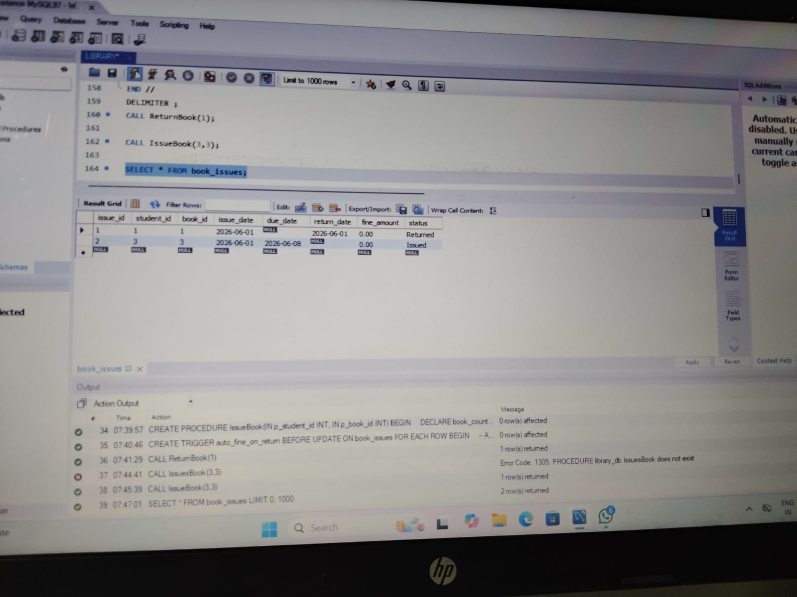
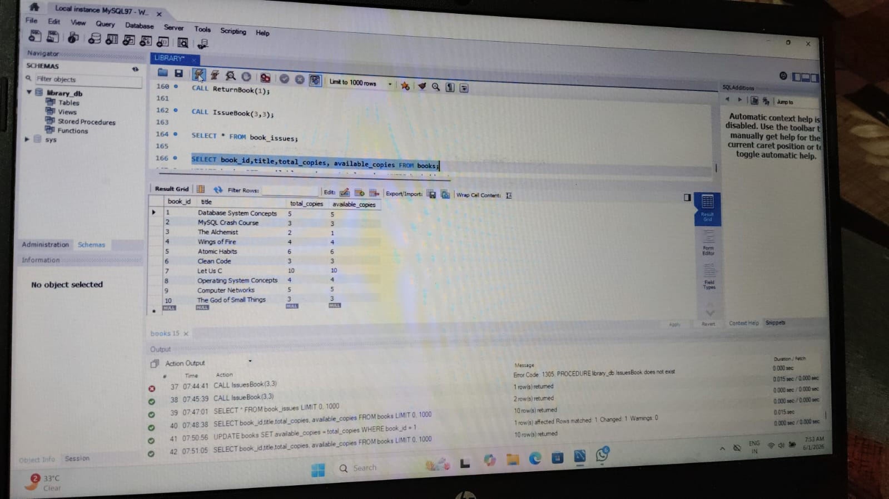
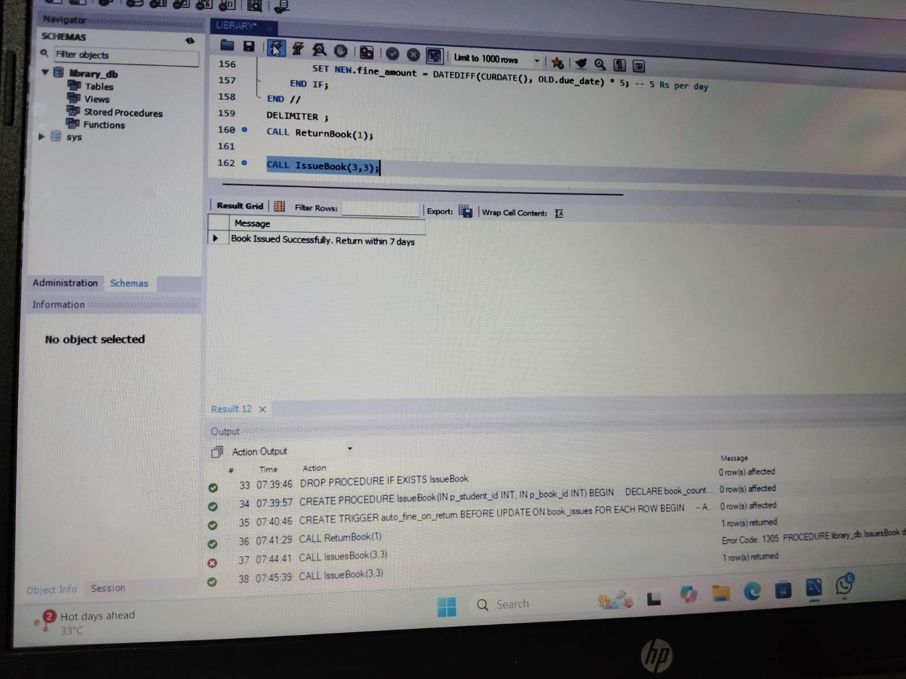
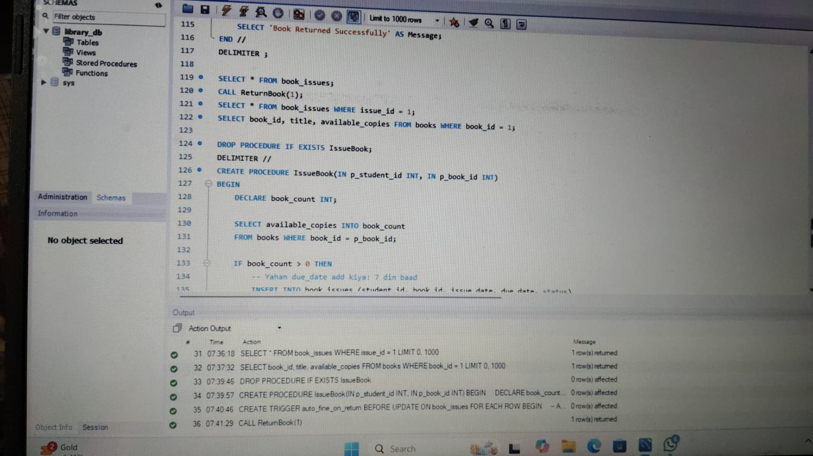
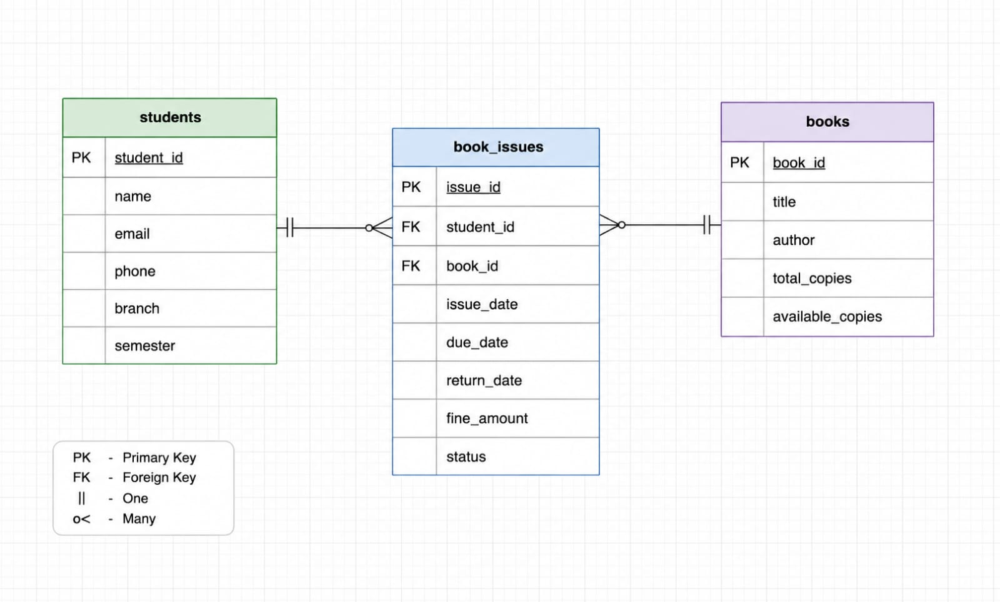

# Library Management System using MySQL
 1  # Library Management System using MySQL
2  
3  [](https://khushi1028.github.io/Library-Management-System-MySQL/)
4  
5  A complete Database Management System project...
A complete Database Management System project for managing library operations using MySQL. This project demonstrates the use of **Stored Procedures**, **Triggers**, and **Views** to automate and simplify library tasks.

## 📌 Features

- **Book Management**: Add, update, delete and search books
- **Member Management**: Register new members and manage member details
- **Issue/Return System**: Issue books to members and track return dates
- **Fine Calculation**: Automatic fine calculation for late returns using Triggers
- **Stored Procedures**: For issuing books, returning books, and generating reports
- **Triggers**: Auto-update book availability and calculate fines on return
- **Views**: Simplified views for available books, issued books, and defaulter list
- **Database Normalization**: Follows 3NF to avoid redundancy

## 🛠️ Tech Stack

- **Database**: MySQL 8.0+
- **Tools**: MySQL Workbench / phpMyAdmin
- **Language**: SQL

## 📂 Database Structure

**Main Tables:**
1. `Books` - Stores book details like BookID, Title, Author, ISBN, Quantity
2. `Members` - Stores member info like MemberID, Name, Email, Phone
3. `IssueRecords` - Tracks which book is issued to which member with dates
4. `Returns` - Stores return details and fine if applicable

**Key Components:**
1. **Stored Procedures**: 
   - `IssueBook()` - Issues book to member
   - `ReturnBook()` - Handles book return + fine
   - `GetDefaulterList()` - Lists members with pending fines

2. **Triggers**: 
   - `after_book_issue` - Decreases available quantity when book issued
   - `after_book_return` - Increases quantity + calculates fine if late

3. **Views**:
   - `AvailableBooks` - Shows only books with quantity > 0
   - `IssuedBooksDetails` - Complete issue info with book + member names

## 🚀 How to Run This Project

1. **Clone the repository**
   ```bash
   git clone https://github.com/Khushi1028/Library-Management-System-MySQL.git

   ## 📸 Screenshots

### 1. Database Tables Structure


### 2. Members Table


### 3. Books Table


### 4. table

### 2. ER Diagram


 
